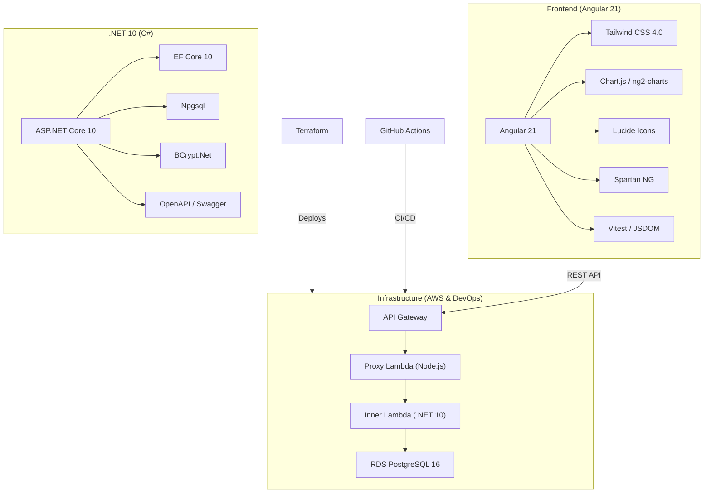
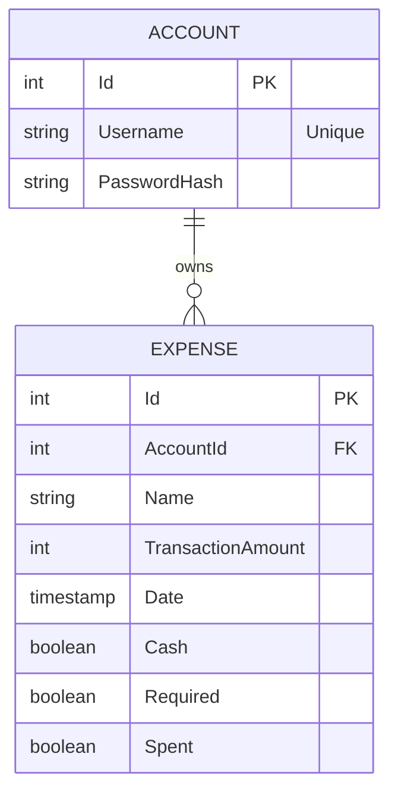

# 💰 Expense Manager

A sleek, modern full-stack application designed to help you track and manage your expenses with ease. Built with a powerful .NET backend and a beautiful Angular frontend, this tool provides real-time insights into your spending habits.

---

## 🚀 Features

- **Real-time Dashboard**: Visualize your spending with dynamic charts and stats.
- **Detailed Tracking**: Categorize expenses, mark them as cash or digital, and track "required" vs "discretionary" spending.
- **Secure Architecture**: Proxy Lambda pattern for secure database access within AWS Free Tier.
- **Responsive Design**: Works perfectly on desktop and mobile.
- **Automated CI/CD**: Seamless deployment via GitHub Actions.

---

### Tech Stack Overview



### Detailed Breakdown

#### Frontend
- **Framework**: [Angular 21+](https://angular.dev/)
- **UI Components**: [Spartan NG](https://www.spartan.ng/) & Custom components.
- **Styling**: [Tailwind CSS 4.0](https://tailwindcss.com/)
- **Charts**: [ng2-charts](https://valor-software.com/ng2-charts/) (Chart.js)
- **Testing**: [Vitest](https://vitest.dev/)

#### Backend
- **Framework**: [.NET 10 Web API](https://dotnet.microsoft.com/en-us/apps/aspnet)
- **Database**: [PostgreSQL 16](https://www.postgresql.org/)
- **ORM**: [Entity Framework Core 10](https://learn.microsoft.com/en-us/ef/core/)

#### Infrastructure & Deployment
- **Cloud Provider**: AWS (Lambda, RDS, API Gateway)
- **IaC**: [Terraform](https://www.terraform.io/)
- **CI/CD**: GitHub Actions
- **Hosting**: GitHub Pages (Frontend) & AWS Lambda (Backend)

---

## 🗄️ Database Schema



---

## 🏗️ Architecture

The project uses a **Proxy Lambda Pattern** to optimize costs while maintaining security:

1.  **GitHub Pages**: Hosts the Angular static files.
2.  **AWS API Gateway**: Entry point for API requests.
3.  **Proxy Lambda (Node.js)**: Runs in the public subnet, receives requests and invokes the Inner Lambda.
4.  **Inner Lambda (.NET 10)**: Runs inside a private VPC, processes business logic and interacts with RDS.
5.  **AWS RDS (PostgreSQL)**: Private database instance accessible only from the VPC.

---

## 🛠️ Getting Started

### Prerequisites
- [.NET 10 SDK](https://dotnet.microsoft.com/download/dotnet/10.0)
- [Node.js & npm](https://nodejs.org/)
- [Angular CLI](https://angular.dev/tools/cli)
- [Docker](https://www.docker.com/) (for local database)

### Local Setup

1.  **Clone the repository**:
    ```bash
    git clone https://github.com/AumPauskar/expense-manager.git
    cd expense-manager
    ```

2.  **Setup Backend**:
    ```bash
    cd expense-manager-app-backend
    docker-compose up -d
    dotnet ef database update --project ExpenseManagerApp.Infrastructure --startup-project ExpenseManagerApp.Api
    dotnet run --project ExpenseManagerApp.Api
    ```

3.  **Setup Frontend**:
    ```bash
    cd ../expense-manager-app-frontend
    npm install
    npm start
    ```

---

